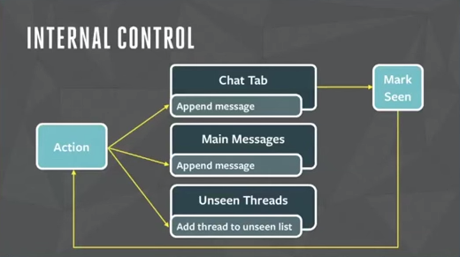

Les dejo el video [Rethinking Web App Development at Facebook](http://youtu.be/nYkdrAPrdcw). Está bueno para ver las preguntas que se hacen, y las respuestas que encuentran.

## Mis notas

Un objetivo que Facebook persigue es **generar software de calidad**.

Según ellos, se entiende por calidad a:

- **un código seguro.**
- **un código performante.**
- **una UI "disfrutable".**
- **una interfaz facil de usar (UX).**

La calidad lleva tiempo. Cuanta más calidad se busca, más tiempo lleva desarrollarlo.

Lo que más se valora en Facebook es la habilidad de moverse rápido. Necesitan salir a producción cuanto antes para recolectar métricas, feedback, etc. Así, pueden iterar lo mas rápido posible y tener el mejor producto.

En el video comentan que calidad y velocidad no conviven.

## Cómo lograr mejor calidad en menos tiempo

Intentaron varias cosas. A nivel equipo:

- Recortar features: *"pero si estás queriendo agregar valor a tu producto, eliminar funcionalidades para tener lo mínimo indispensable no está bueno."*
- Agregar gente: *"pero no podés agregar developers a un problema esperando que lo resuelvan mas rápido y con buena calidad."*
- Pedirle a la gente que trabaje mas duro: *"pero no es sustentable pedir que trabajen 15 horas por día."*

A nivel stack tecnológico intentaron aplicar MVC, pero no escala porque se empieza a complicar muy rápido. **Cada vez que agregan nuevos features, el sistema entero cambia.** Esto genera que el código sea impredecible. Es decir que, entra gente nueva a ver el código y les toma tiempo para entender si lo que se va a modificar impacta en el resto de la aplicación.

Para aumentar la calidad y reducir el tiempo, probaron hacer que el código sea predecible. Aplicaron Flux Pattern: **una arquitectura que genera un flujo de datos unidireccional (a diferencia del MVC)**.

## MVC pattern

Buenísimo para aplicaciones chicas pero difícil de entender qué vista se relaciona con qué modelo:

## Flux pattern

Flujo de datos de una sola dirección. Las "flechas" van en un solo sentido:

Ponen como ejemplo el chat de Facebook, que necesita comunicarse con la barra de notificaciones.

A medida que fueron agregando features, el código se les hizo largo. Y en lugar de darle el control a un agente externo (handler), se le da el control a cada integrante:

A partir de acá, el video trata de React. Es un framework de Facebook que implementa Flux.

## React

- Recarga todo el componente entero cuando cambia una parte.
- Para que no sea pesado usa un DOM virtual. Hacen cambios individuales ahí y después pisan todo el componente una sola vez en el DOM real.
- Todo Instagram esta hecho con React.
