Everything started back in 2013 when I luckily won a starter kit from [Make: Magazine](https://makezine.com/) with a Raspberry Pi Model 1.

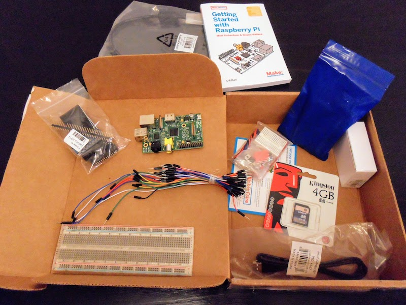

Since then, I was looking for something interesting to build, but it was more difficult that I thought.

I've almost gave up when I found [RetroPie](https://retropie.org.uk/).

## RetroPie

This [project](https://retropie.org.uk/) allows you to turn your Raspberry Pi into a retro-gaming machine. So I made a quick test with some ROMs to check how it worked. It was effortless to have a working retro console with almost zero configuration.

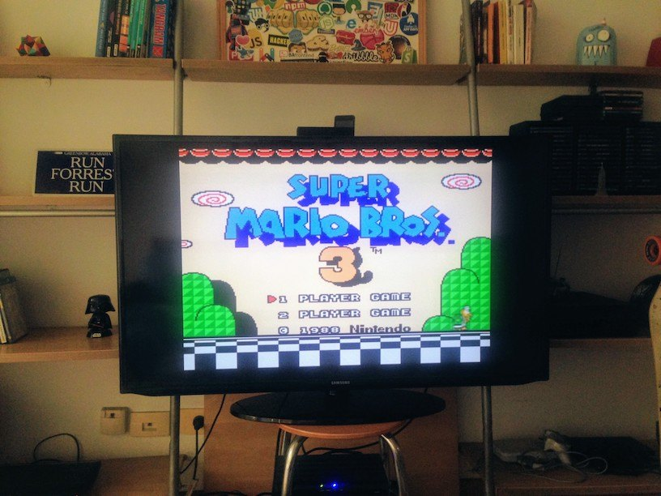

It took me [many attempts to setup RetroPie to make the most of it](/articles/a-complete-guide-to-setting-up-retropie/), but everything was worth in the end.

## Goals

When I had RetroPie running, I realized that I could fit everything inside an arcade cabinet.

I started looking everywhere for cabinets to restore. I only found costly wooden boxes in very bad conditions.

Most of them were:

- Not worthwhile for restore.
- Heavy/Hard to move.
- Too big for an apartment.
- Expensive.

So I realized that the only way to get the results I wanted would be by building my own arcade cabinet from scratch.

In that terms, I was looking for something that was:

- Easy to build and move.
- Affordable.
- Sized for an apartment.
- Old-school/Nostalgic shape.

## The plans

Right after I defined what would be an ideal arcade machine I looked for some information on how to build one.

I found [Project MAME](http://koenigs.dk/mame/eng/index.htm) that provides open source plans to build an arcade cabinet from scratch.

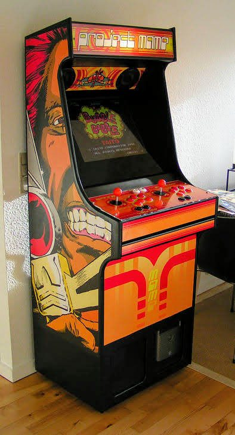

It was planned to hold a PC with keyboard and everything. But it was also a good adaptation from old-school cabinets. The most important feature is that it was made to fit a flat screen inside.

One of the cabinets that came up from Project MAME was this beautiful [Paper Mario themed arcade](http://zonaarcade.forumcommunity.net/?t=48865036).

This maker [improved the original plans](http://img543.imageshack.us/img543/5624/repordiviciacosplanos.gif) to use only MAME controllers and to have a larger marquee. He also made available the [side art](https://zonaarcade.forumcommunity.net/?t=45015457) and a SketchUp model.

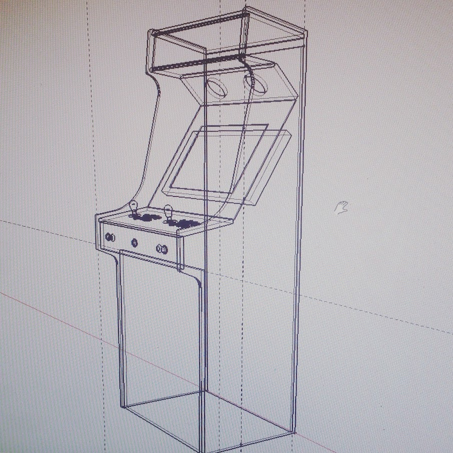

I only had to modify the width of the original plans by 2cm so the cabinet could fit an old 26" monitor that I've already had. The rest was followed as specified.

## A model in cardboard

The first approach to test the size and position of the elements was making a 1:10 model in cardboard.

That way I was sure that all made sense and I was able to check if something needed to be adjusted or redefined. Especially after the width modification that I had to do.

The model is 17cm height and it was very helpful on defining the size and distribution of the speakers.

## Materials

Before I spent money on materials, there was a very important decision to make about what kind of wood I should use: **MDF, plywood or particleboard**.

I chose MDF, but if I would know at that time how hard is to clean up the thin powder result of sanding, I would chose another material. But in the other hand, it was a very versatile wood: easy to cut, drill and shape.

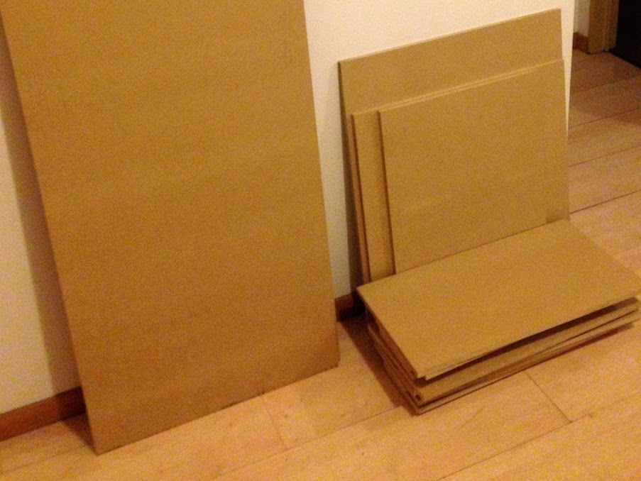

The materials I used trough the entire project were:

### MDF boards (15mm):

- **(2) 169cm x 60cm:** Both laterals
- **28cm x 62cm:** Marquee top panel
- **(2) 16cm x 62cm:** Marquee bottom panel and speakers panel
- **(2) 25cm x 62cm:** Monitor support and controllers top panel
- **12cm x 62cm:** Controllers front panel
- **75cm x 62cm:** Front panel
- **60cm x 62cm:** Back panel
- **45cm x 62cm** Bottom cover
- **94cm x 62cm x 5mm thickness** Back door

### Crystal clear acrylic sheets:

- **55cm x 62cm x 2.4mm thickness:** Monitor cover
- **25cm x 62cm x 2.4mm thickness:** Controllers art cover
- **(2) 13cm x 62cm x 4mm thickness:** Marquee back and front

### Others:

- [4cm x 2cm pine strips](#strips)
- [80- and 360-grit sandpaper](#sandpaper)
- #6 x 1¼" golden screws for the strips
- #6 x 1½" black screws for the MDF boards

## First cuts

After bringing home all the MDF boards, I started drawing the shape in both laterals based on the plans. I've also used a pair of compasses to draw the curves.

I joined both laterals with paper tape to make only one cut. Then, using a jigsaw, I went from bottom to top. I always recommend to move with caution to stick to the line as much as possible.

When I finished cutting, I learnt some things:

- **MDF detaches a thin powder:** It doesn't matter how much protection I wore (gloves, mask, safety glasses). I've had to deal with powder in my hair and clothes for days. It was a nightmare to clean up after cut or sand. I even broke a vacuum cleaner trying to clean it up.
- **The hot blade will burn the wood:** Unless you let the jigsaw cool down from time to time. Don't try to make a cut in one single run.
  
- **While making a cut on a thick wood, the blade curves:** In my case it would have been better not to cut both boards together. That's because the wider is what you're cutting, the more the blade tends to curve. I've had to fix the uneven edges by sanding.

## Sandpaper

I used 80- and 360-grit sandpaper. The first one is a coarse grit for smoothing surfaces and removing imperfections. The second one is a fine grit for finishing surfaces smoothly.

After sanding all the edges I achieved great results giving a rounded shape to the corners and fixing some mistakes I made during the cut.

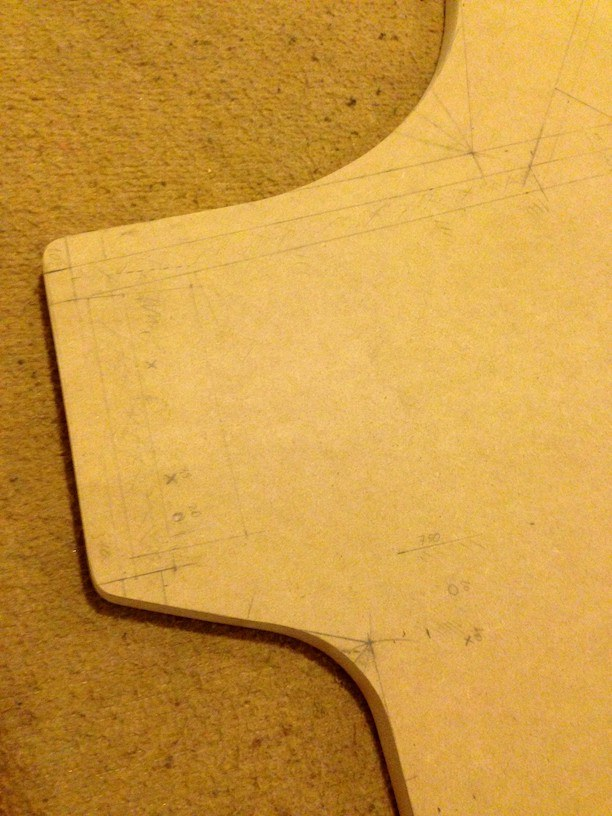

I later used the 360-grit sandpaper to smooth the surfaces between each paint coat.

## Strips

I decided to join all the pieces with strips, glued and fixed with screws. That way I had millimetric precision to position the MDF boards.

I cutted a bunch of 4cm x 2cm pine strips to the size of boards they had to join.

It's not necessary to use glue when you're already using screws, but I decided to use it anyway to hold tight the entire structure. I've also made a bigger hole for the head of the screws to give the strips a better finish.

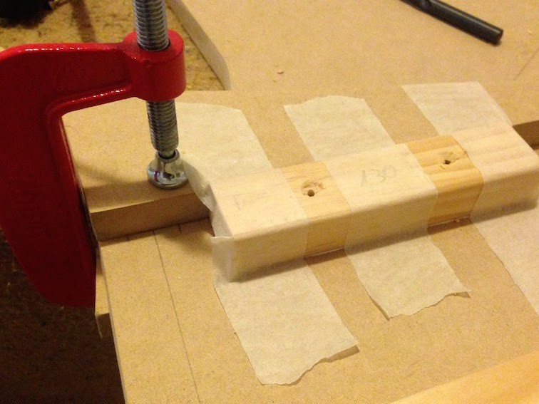

I attached all the strips to both lateral boards using #6 x 1¼" golden screws and carpenter's wood glue.

## First assembly

I put all the pieces together to see the final shape and size. My first impression was to see a huge fridge inside my apartment, but it was improving as the project progressed.

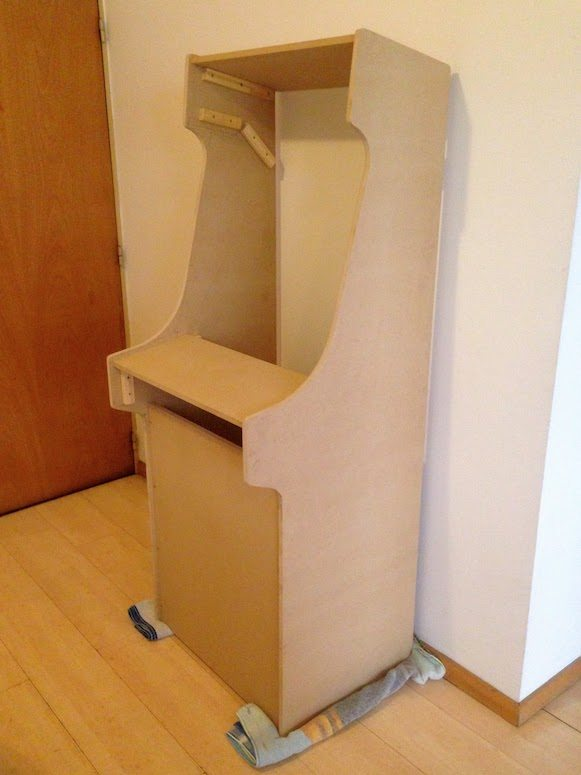

I started by joining the front and back panels with #6 x 1½" black screws but using no glue until I made the final touches.

I've also installed the bottom cover and attached two wheels to handle the cabinet around. I made a diagonal cut in both laterals to let the wheels lean on the floor when the cabinet is inclined.

## Monitor

I had a good old Samsung T260n 26" LCD monitor that was perfect for this cabinet. In my opinion an ideal size would be about 23", but I wouldn't spend money in a new monitor when I had this one at home.

There was one constraint: this monitor has no holes in the back to attach to a wall mount. But I luckily found an unofficial mount that replaces the original base.

I installed the mount over a "T" board of 25cm x 62cm that I improvised to support all the weight it could handle.

To make the maths to align the monitor, I made a paper doodle with the size of the screen and installed inside the cabinet.

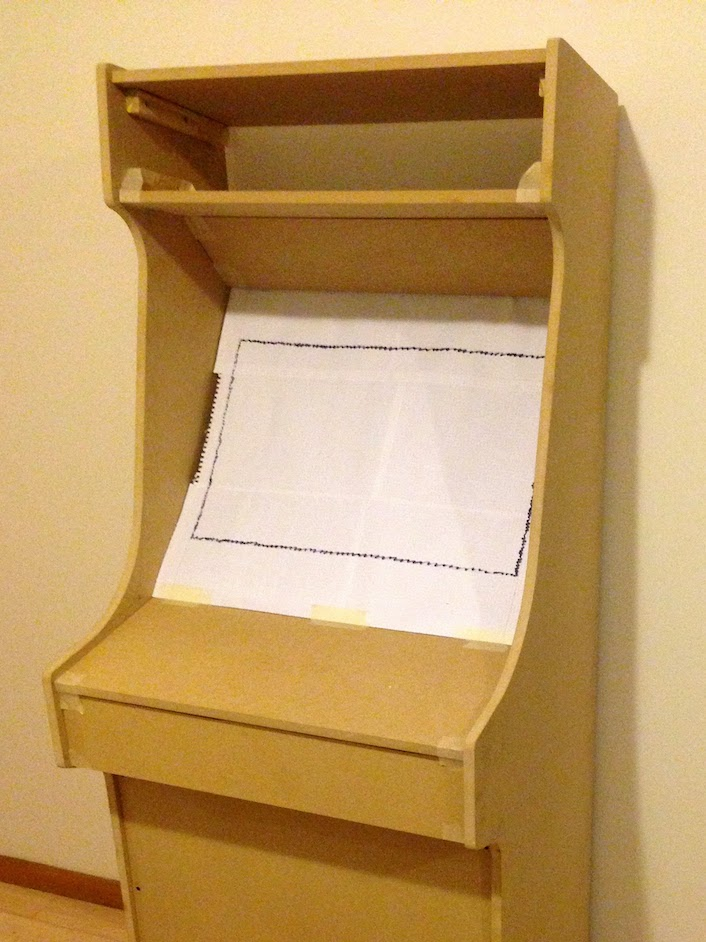

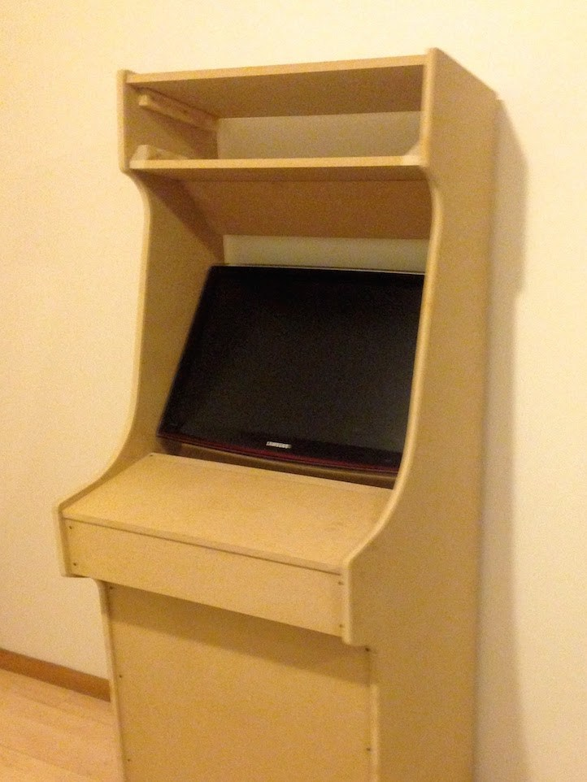

Using some strips leftovers, I cut two back supports for the monitor and two triangles to hold the [acrylic cover](#acrylics).

## Controllers

It's plenty of controllers available for DIY projects out there. I bought a MAME kit which includes:

- 2 Sanwa-like joysticks.
- 16 HAPP push buttons: 7 in red, 7 in blue and [2 in white to play pinball](#final-form).
- 1P/2P buttons.
- USB board with cables for each button and both joysticks.

I made a little research about button positions in arcade cabinets. I found this [complete article](https://www.slagcoin.com/joystick/layout.html) about the most common panel layouts.

The author of the article has also made his own distributions based on an average of all the controllers.

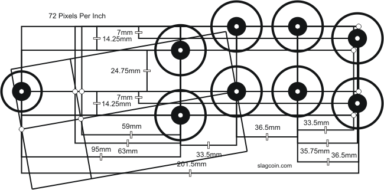

I used a mix between some Sega layouts and tested on a cardboard box.

I drew the layout for both players on the MDF board and drilled.

Then I installed the MAME kit including both joysticks, 14 push buttons, 1P/2P buttons and the USB board.

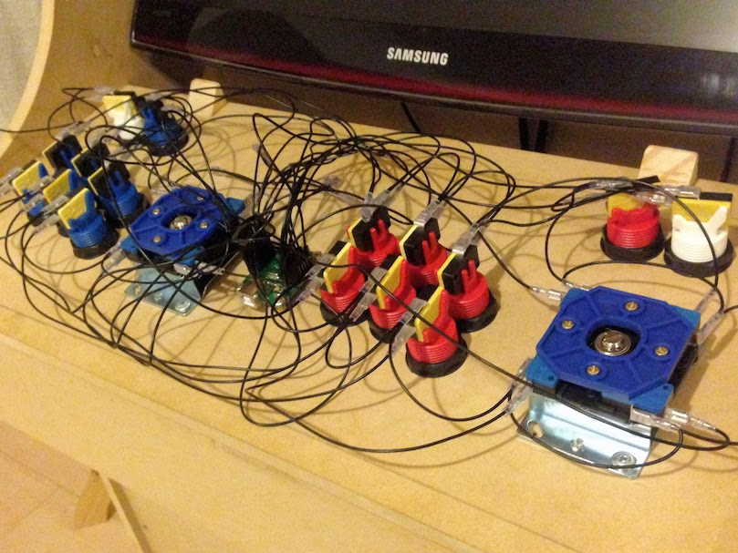

## Speakers

I had a Genius 2.1 channel speaker system with wooden cabinet that I bought back in 2007 with my first job. It has an exceptional deep bass.

The cardboard model was very useful to make a first check on speakers size and distribution. Then I used some paper stencils to make adjustments in the actual cabinet to find the perfect spot for speakers holes and grills.

Besides the speaker system has only one subwoofer, I decided to make two holes to hold a 140mm computer case fan.

I found generic speakers grilles at [AliExpress.com](https://www.aliexpress.com):

- (2) 9cm black mesh (12cm including frame)
- (2) 15cm black mesh (18cm including frame)

## Acrylics

I bought some crystal clear acrylic boards to cover the monitor, controllers and marquee.

### Monitor cover

After sanding some edges of the acrylic board of 55cm x 62cm x 2.4mm, I attached it to the triangle strips and put some screws in the back of the speakers board.

### Marquee

I used 2 acrylic sheets of 13cm x 62cm x 4mm to hold a transparent print in between. I attached both sheets with 4 stainless steel clamps.

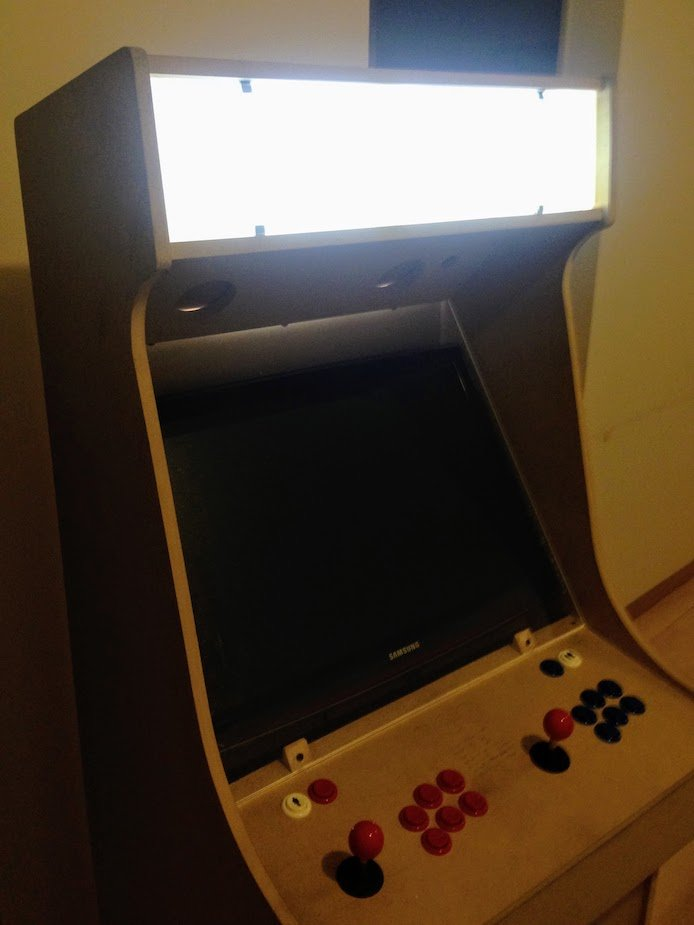

### Controllers cover

I had to drill 18 holes in the acrylic sheet of 25cm x 62cm x 2.4mm for the controllers. So I decided to got one extra sheet to make some tests.

It was the perfect choice because the first experience drilling acrylic was awful. The sheet melted down over the heat of the drill bit and gave uneven results.

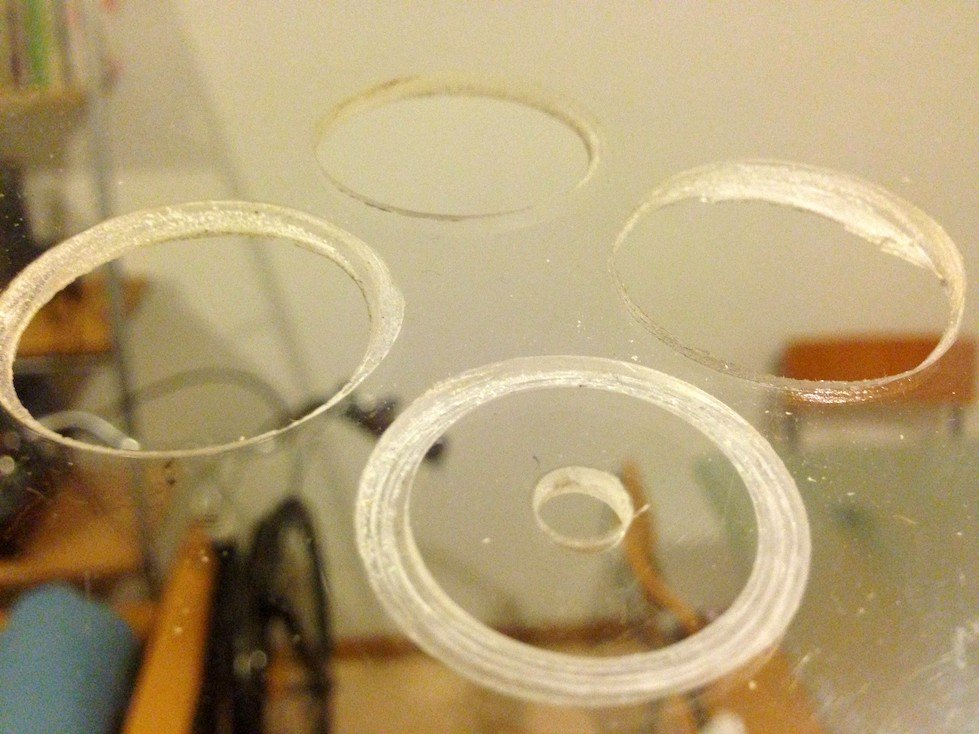

Then I realized that using water keeps the drill bit and the acrylic sheet cold.

It took nearly 10 minutes to make each hole, but with a lot of patience I finished the job.

## Painting

### Wood putty

I covered all the screws with wood putty and sanded until I got a smooth surface.

### Primer

I applied white primer paint for MDF to the entire cabinet. That seals the pores of the wood and set a base color to apply another painting coats.

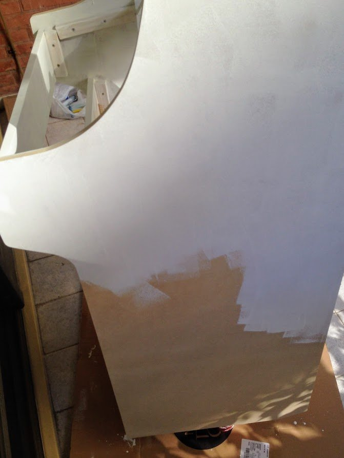

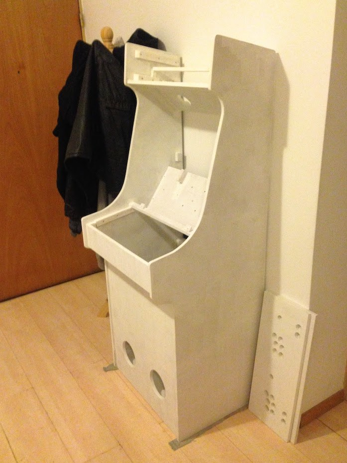

### Black and white

I masked all except both laterals and one of the faces of the controllers board.

Then applied Krylon Colormaster Gloss White where all the printed art was supposed to be placed, to highlight the colors.

I used Krylon Colormaster Flat Black for the rest of the cabinet:

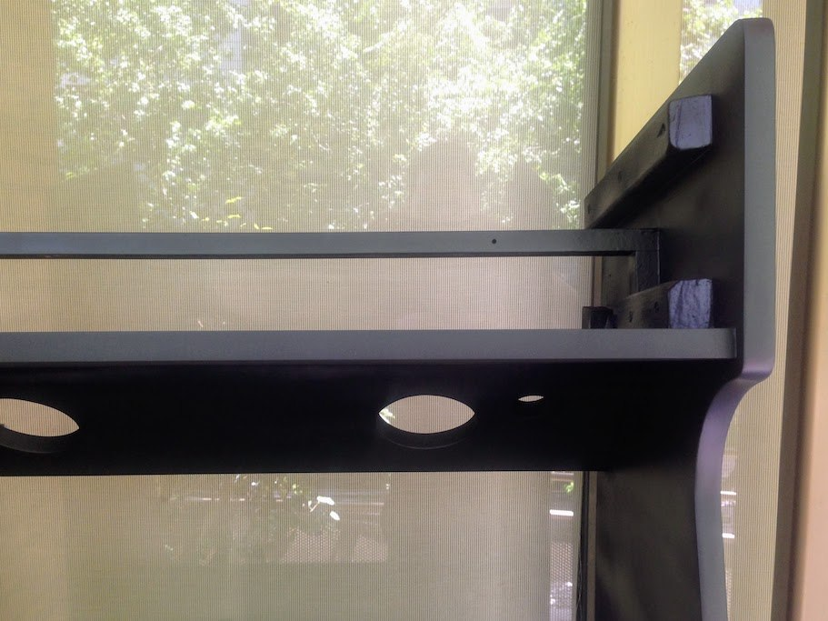

## Self adhesive vinyls

The author of the Paper Mario arcade cabinet made available the [side art](https://zonaarcade.forumcommunity.net/?t=45015457). I printed it in vinyl and installed in all the white sides.

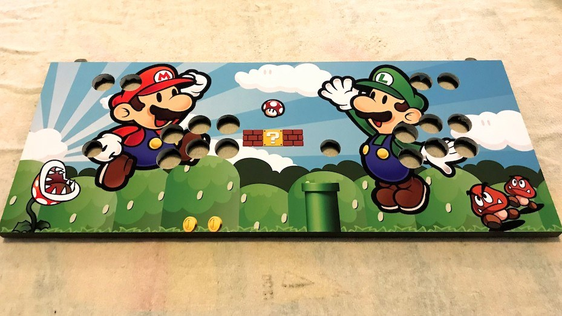

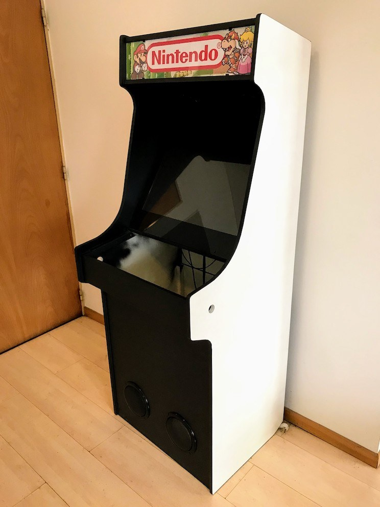

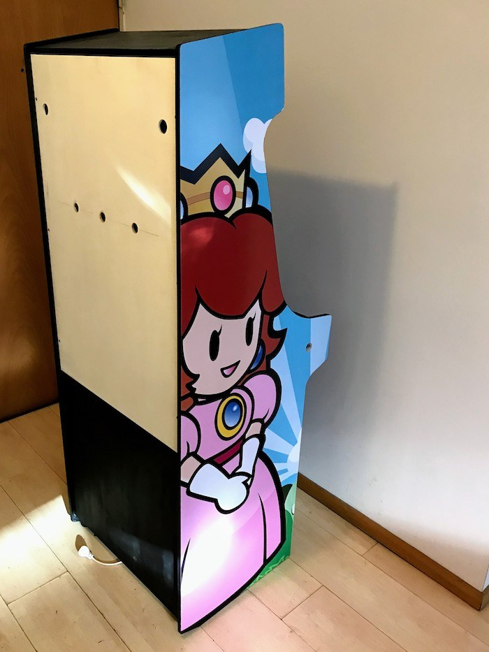

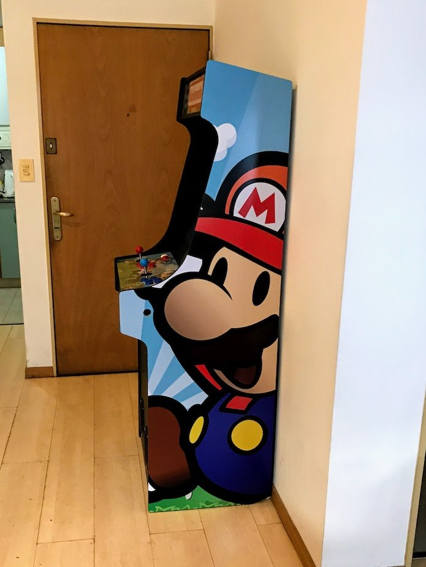

## Finale

The last piece in this 2 years long puzzle were the white buttons in both sides to play pinball games. Those HAPP buttons are connected as an extension of the left arrow of the 1P joystick and one of the buttons of the same player. That's because every retro pinball game I installed uses that controllers as a standard.

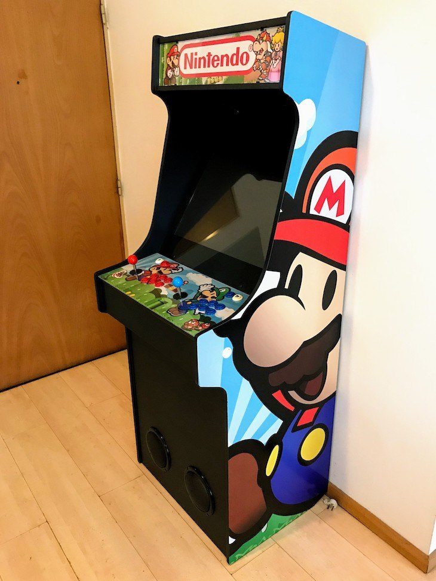

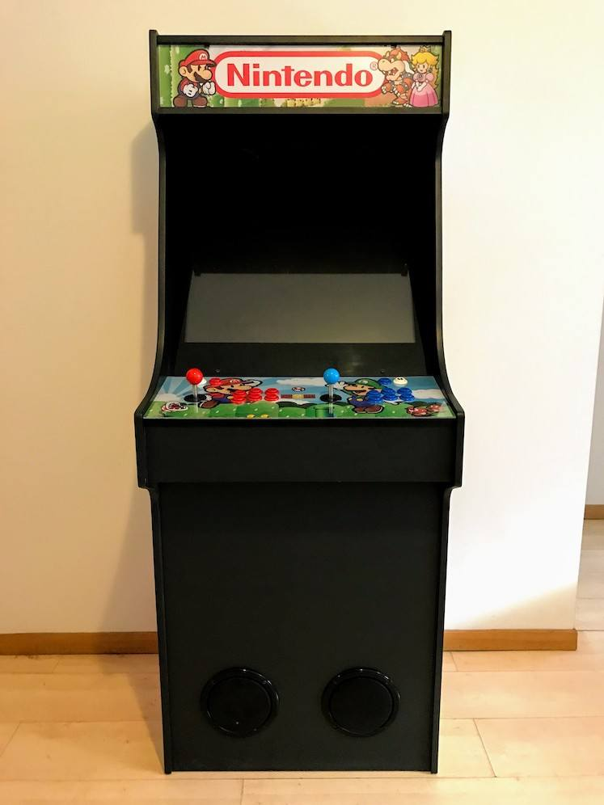
