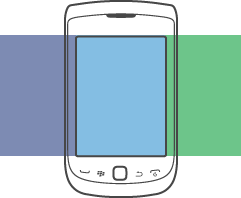
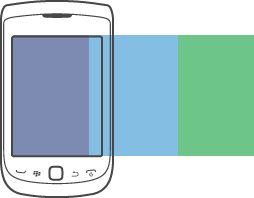
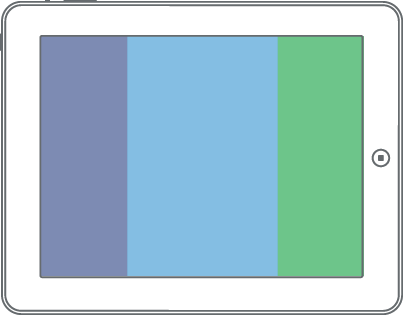

A medida que los layouts responsive fueron evolucionando, surgieron varios patrones que ya tienen nombre y apellido.

# Los más populares

Según [Luke Wroblewski](https://twitter.com/lukew) (groso), los patrones más populares son:

- Mostly Fluid
- Column Drop
- Layout Shifter
- Tiny Tweaks
- Off Canvas

En su [post](http://www.lukew.com/ff/entry.asp?1514) explica y grafica cada uno.

# Off Canvas

Un web designer tomó el patrón Off Canvas (uno de los que mejor se adaptan) y profundizó un el concepto:

http://jasonweaver.name/lab/offcanvas/

Básicamente se trata de un layout de 3 columnas que se acomoda segun el tamaño de pantalla.

Dentro de las columnas, **el contenido principal se ubica en la columna central**.

Los elementos secundarios o de navegación se ubican en las columnas de los costados.

# Ejemplos

Centrado por default:

Acceso a sección izquierda:

Cuanto mayor es el espacio en la pantalla, más columnas se muestran dentro del area visible.

# Más patrones

[Brad Frost](https://twitter.com/brad_frost) (otro groso) escribió hace un par de años algunos posts sobre patrones de navegación responsive. Explica en detalle pros y contras de varios:

- Top Nav or "Do Nothing" Approach
- Footer Anchor
- Select Menu
- The Toggle
- Left Nav Flyout
- Footer-Only
- "Hide N’ Cry"
- Multi-Toggle
- Ol’ Right-to-Left
- "Skip the Sub-Nav"
- The Carousel+

Más info sobre estos patrones en:

- [Responsive Navigation Patterns](http://bradfrostweb.com/blog/web/responsive-nav-patterns/)
- [Complex Navigation Patterns for Responsive Design](http://bradfrostweb.com/blog/web/complex-navigation-patterns-for-responsive-design/)
