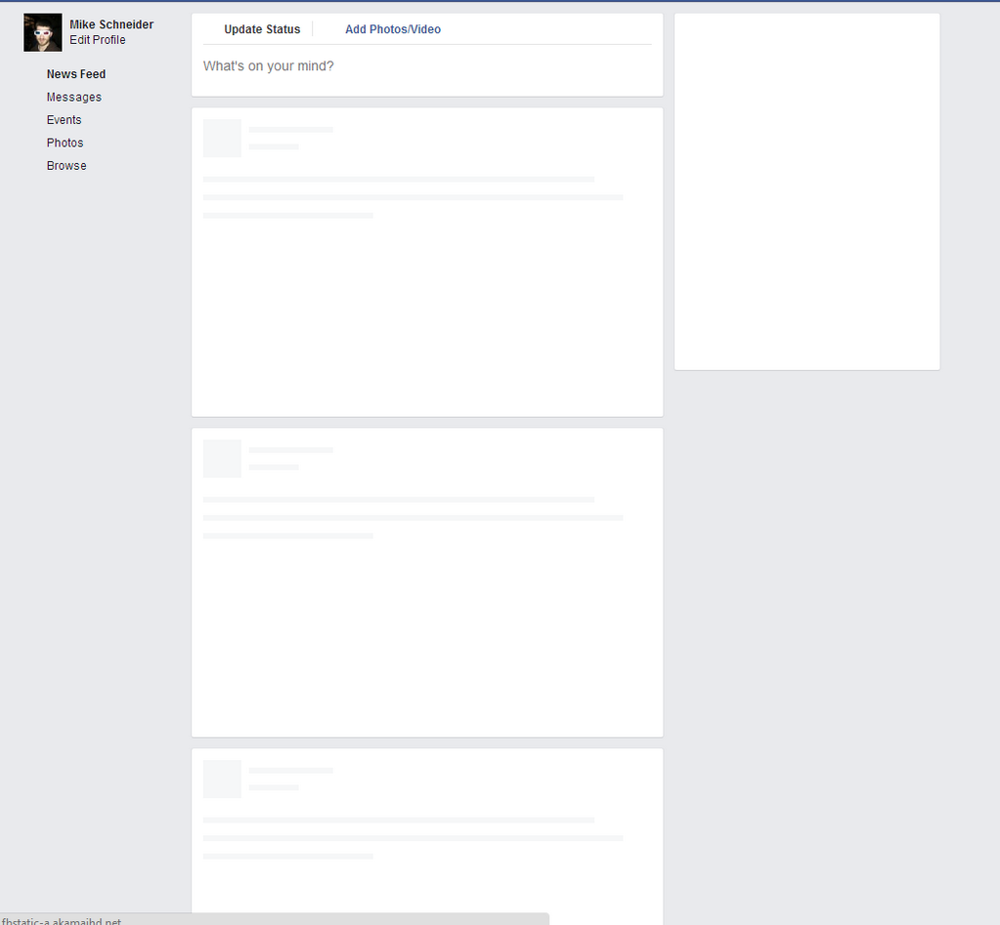

Desde hace unos meses estoy implementando en algunos proyectos lo que se conoce como Single Page App.

Para quienes no conocen el término, Wikipedia tiene una definición muy completa:

http://en.wikipedia.org/wiki/Single-page_application

Según la definición, el objetivo principal de una SPA es **proveer una UX más fluida**.

Esto significa que existen algunas ventajas extra a nivel UI, y que se necesitan hacer algunos cambios a nivel interacción con el usuario.

Hay 2 características importantes que redefinen la UX y que considero las más importantes:

# 1. Cero tiempo de carga

En una SPA el usuario **no percibe un tiempo de espera entre una página y la otra**. **Todo es instantáneo, literalmente.**

Lo que sí tiene tiempo de carga es la información, pero no la UI.

Entonces empiezan a aparecer patrones de diseño como Skeleton layout o "non-blocking interfaces", que ya lo habrán visto usando Facebook:

Primero se carga el esqueleto de la página, porque es lo que nunca cambia y puede volver a imprimirse instantaneamente entre pantallas. Después se carga la data.

Les dejo un artículo de Luke en el que explica cómo usando Skeleton pudieron evitar usar la ruedita de loading.

[Mobile Design Details: Avoid The Spinner](http://www.lukew.com/ff/entry.asp?1797)

También les dejo un video muy útil de Guille Rauch sobre cómo mejorar la interacción del usuario mejorando la percepción de velocidad.

Muestra muchos ejemplos andando. Si tienen unos minutos, no se lo pierdan:

[Video - The need for speed](https://www.youtube.com/watch?v=Ar9R-CX217o)

# 2. Flujos que dejan de ser lineales

La página no se recarga nunca cuando el usuario navega.

Esto nos permite hacer tareas en el fondo.

Un ejemplo claro podría ser en el flujo de venta de MercadoLibre. Cuando el usuario carga una foto, no es necesario dejarle el foco sobre el progreso de las fotos subiendo.

Se puede hacer que siga modificando otros datos mientras esa tarea se hace de fondo.

Los flujos dejan de ser lineales, y hay formas de darle feedback al usuario sobre esto.

Prueben adjuntar archivos a un mail en Gmail y apretar Enviar antes de que se terminen de adjuntar.

# 3. Para más adelante...

Hay muchas más características que pueden redefinir la interacción del usuario en las SPA.

Lo importante es poder ver que hoy en día ya tenemos la posibilidad de mejorarle notablemente la experiencia al usuario.

[Ir a la parte 2](#)
